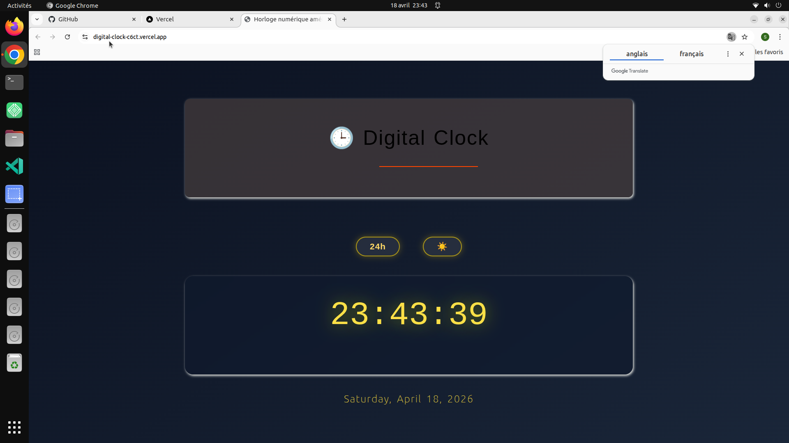

# ⏱️ Digital Clock

A modern and responsive digital clock built with HTML, CSS, and JavaScript.

---

## 🔗 Live Demo
https://digital-clock.vercel.app

## 📂 GitHub Repository
https://github.com/saidhadjadj/digital-clock

---

## 🌍 Overview
This project displays the current time in a digital format with real-time updates. It focuses on simplicity, readability, and smooth UI rendering.

---

## ✨ Features
- ⏱️ Real-time digital clock
- 🔄 Live time updates (seconds, minutes, hours)
- 📱 Fully responsive design
- 🎨 Clean and modern interface
- ⚡ Lightweight JavaScript logic

---

## 📸 Preview

---

## 🛠️ Tech Stack
- HTML5
- CSS3
- JavaScript (ES6)

---

## 🎯 Purpose
This project demonstrates real-time data handling, DOM updates, and UI design for time-based interfaces.

---

## 👤 Author
Said Hadjadj
